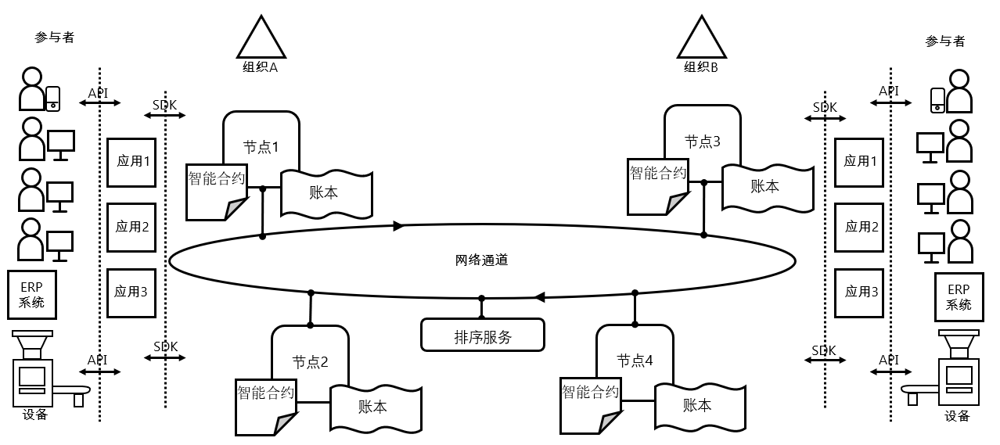
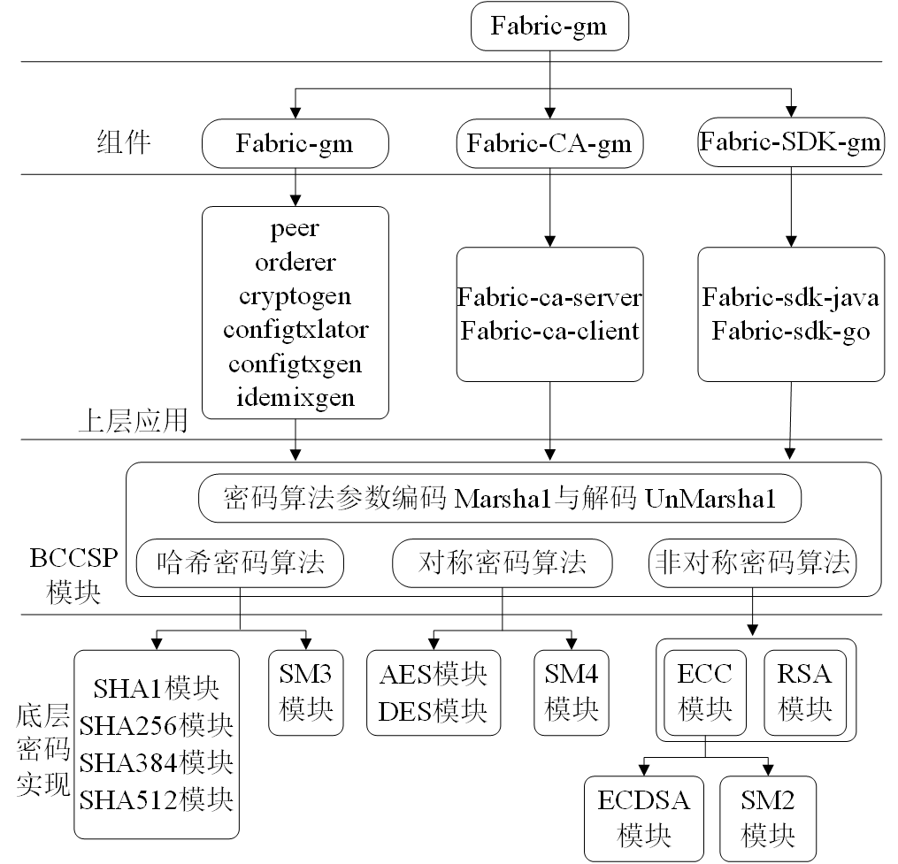
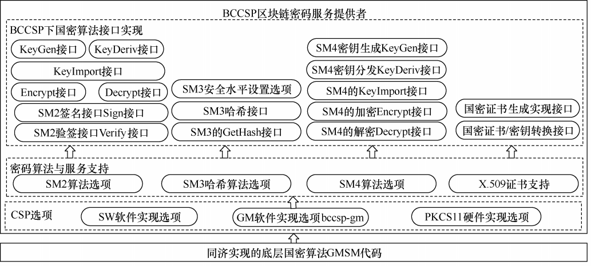
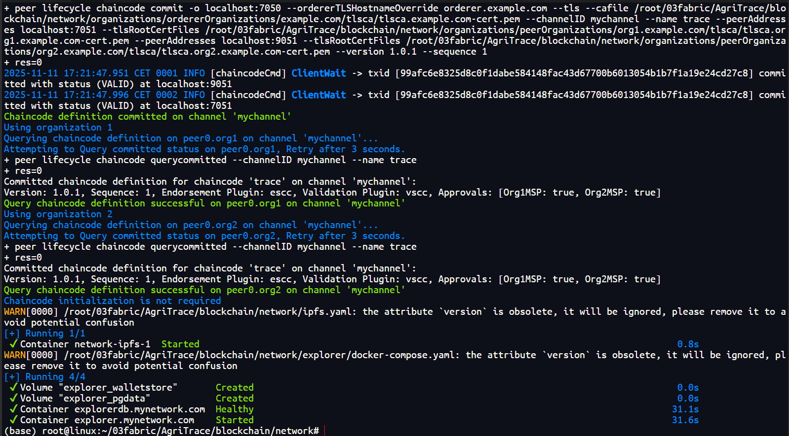
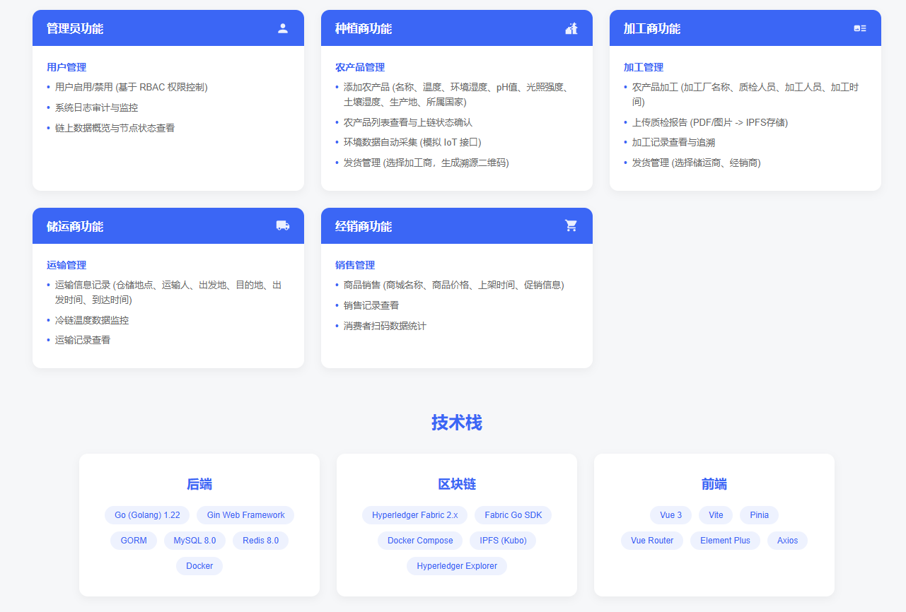
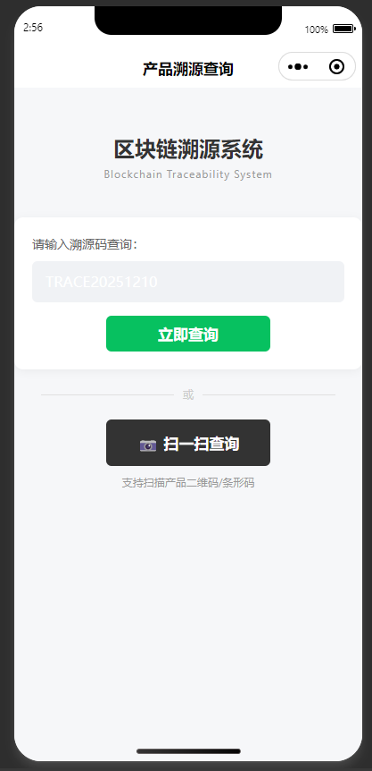
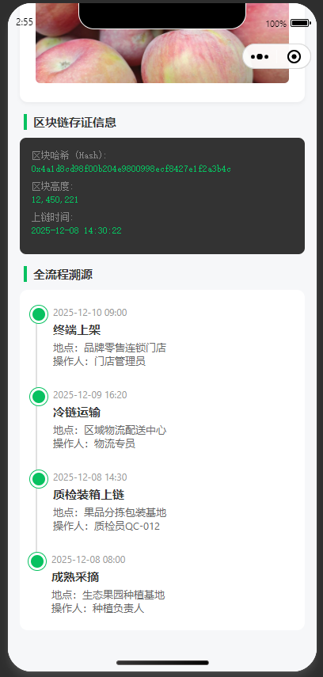
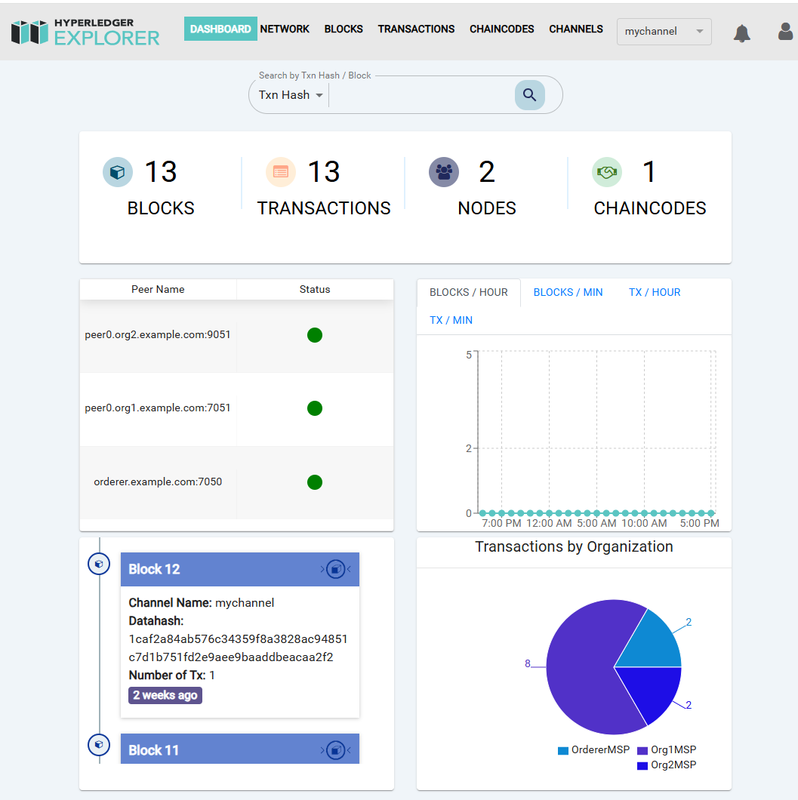
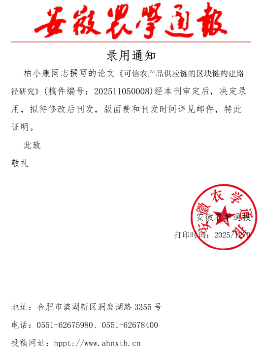
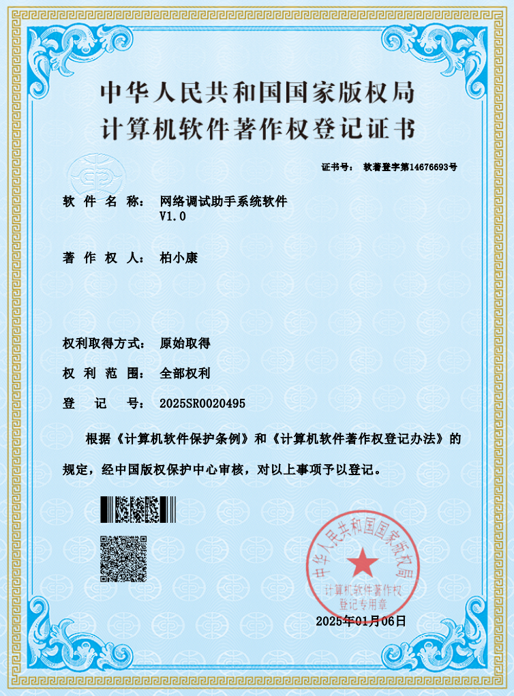

# 幻灯片 1：封面

**主标题**：基于区块链技术的农产品溯源关键技术研究
**副标题**：塔里木大学研究生中期考核汇报
**汇报人**：柏小康
**学号**：10757232282
**专业**：农业工程与信息技术
**导师**：张楠楠 教授
**考核日期**：2025年12月14日

# 幻灯片 2：汇报目录

**CONTENT**

1.  **研究内容概述** 
2.  **研究工作进展** 
3.  **阶段性成果**
4.  **存在问题与解决措施** 
5.  **下一步研究计划** 

---

# 幻灯片 3：基本情况简述

<!-- 布局：左右布局，左侧为文字，右侧可以留白或放校徽 -->

**个人基本情况**

*   **课程学习**：已完成培养方案规定的全部课程，修满 **28.0** 学分，加权平均分 **81.8**。
*   **思想品德**：思想政治坚定，恪守学术道德，无任何学术不端行为。
*   **专业实践**：在新疆数字兵团信息产业发展有限责任公司完成6个月专业实践，深度参与区块链项目研发。

---

# 幻灯片 4：一、研究内容概述

<!-- 布局：左文右图 -->

**1.1 研究背景与对象**
*   **应用背景**：以新疆特色农产品——**阿克苏苹果**为具体研究对象，针对其供应链长、假冒伪劣频发、品牌保护难等痛点。
*   **标准依据**：系统设计严格遵循国家标准 **《GB/T 29373-2012 农产品追溯要求 果蔬》**，确保溯源信息的规范性与通用性。

**1.2 研究目标**

*   构建基于 **Hyperledger Fabric** 联盟链的溯源体系。
*   攻克 **国密算法（SM系列）** 在区块链底层的适配难题。
*   解决海量多媒体数据存储瓶颈（**IPFS**）。

<small>图：符合国标要求的农产品全流程溯源逻辑</small>

---

# 幻灯片 5：二、研究工作进展

**本章节将从以下三个维度汇报：**

1.  **顶层设计**：技术路线与架构模型
2.  **核心攻关**：国密算法嵌入与底层改造
3.  **系统实现**：原型系统开发与测试

---

# 幻灯片 6：2.1 技术路线与架构设计

<!-- 布局：全屏大图，底部文字说明 -->

**总体技术路线**
遵循“需求分析 -> 方案设计 -> 算法攻关 -> 系统开发 -> 实验验证”的路径。

*   **底层层**：Hyperledger Fabric + 国密改造 (BCCSP)
*   **数据层**：LevelDB (链上数据/索引) + Mysql(链下数据)+IPFS (大文件存储)
*   **应用层**：Gin (Go) + Vue3 (Element Plus)

---

# 幻灯片 7：2.2 系统架构模型

<!-- 布局：左图右文 -->

**“区块链+IPFS”双存储模型**

*   **链上存储 (On-Chain)**：
    *   存储关键交易元数据、哈希摘要、签名。
    *   保障数据的不可篡改性与法律效力。
*   **链下存储 (Off-Chain)**：
    *   利用 **IPFS (星际文件系统)** 存储阿克苏苹果的产地照片、质检报告(PDF)、环境监测视频。
    *   解决区块链存储成本高、效率低的问题。

---

# 幻灯片 8：2.3 网络拓扑与部署

<!-- 布局：全屏图展示 -->

**Hyperledger Fabric 业务网络**

*   **多组织架构**：模拟种植商(Org1)、加工商(Org2)、物流商等多方参与。
*   **隐私隔离**：利用 Channel 通道技术，实现不同业务数据的安全隔离。

---

# 幻灯片 9：2.4 核心攻关：国密算法嵌入 (设计)

<!-- 布局：左文右图 -->

**BCCSP 国密化改造方案**

为满足国内信息安全自主可控要求，对 Fabric 的 **BCCSP (Blockchain Cryptographic Service Provider)** 模块进行重构。

*   **SM2**：替换 ECDSA，用于交易签名、节点身份认证。
*   **SM3**：替换 SHA256，用于区块哈希计算、数据完整性校验。
*   **SM4**：替换 AES，用于敏感数据加密。

---

# 幻灯片 10：2.4 核心攻关：国密算法嵌入 (实现)

<!-- 布局：双图并列 -->

**底层接口适配实现**

*   **左图**：基于开源国密库，封装 BCCSP 接口 (KeyGen, Sign, Verify)，实现国密算法的插件化加载。
*   **右图**：改造 Fabric-CA 的证书签发逻辑，使其支持生成基于 SM2 公钥的 X.509 证书。

|  |  |
| :----------------------------------------------------------: | :----------------------------------------------------------: |
|            <small>BCCSP 国密接口封装逻辑</small>             |           <small>Fabric-CA 证书工具类改造</small>            |

---

# 幻灯片 11：2.4 核心攻关：国密性能评估

<!-- 布局：左侧文字结论，右侧图表 -->

**算法有效性与性能验证**

*   **功能验证**：通过单元测试验证了 SM2 签名/验签接口的正确性（如下图左）。
*   **性能对比**：经测试（如下图右），SM2/SM3 算法在时间开销上略高于原生算法，但仍在毫秒级范围内，满足供应链实时溯源的性能需求。

|  |  |
| :----------------------------------------------------------: | :-----------------------------------------------------: |
|               <small>SM2 接口功能验证</small>                |           <small>密码算法时间开销对比</small>           |

---

# 幻灯片 12：2.5 系统原型实现——功能模块

<!-- 布局：中心大图 -->

**系统功能模块设计**

基于 **GB/T 29373-2012** 标准，设计了涵盖果蔬生产、加工、分销、零售全环节的功能模块。
*   **核心模块**：用户管理、信息录入（上链）、溯源查询、监管审计。

---

# 幻灯片 13：2.5 系统实现——网络启动与后端

<!-- 布局：左文右图 -->

**Fabric 网络环境搭建**

*   **部署环境**：Ubuntu 20.04 + Docker 28.1.1
*   **启动状态**：成功启动 Orderer 共识节点及 Peer 节点，链码容器实例化成功。
*   **后端服务**：基于 Go SDK 与区块链网络建立稳定连接。

<small>Hyperledger Fabric 网络启动日志截图</small>

---

# 幻灯片 14：2.5 系统实现——Web管理端

<!-- 布局：多图展示 -->

**企业端操作界面**

*   **登录页**：集成 JWT 认证与 RBAC 权限控制。
*   **工作台**：种植户录入阿克苏苹果的施肥、浇水记录（环境数据），加工商录入分拣、装箱信息。

|  |  |
| :--------------------------------------------------: | :----------------------------------------------------------: |
|             <small>系统登录界面</small>              |                <small>信息录入工作台</small>                 |

---

# 幻灯片 15：2.5 系统实现——C端溯源查询

<!-- 布局：手机界面截图 -->

**消费者溯源体验 (小程序)**

*   **查询入口**：支持扫码或输入溯源码查询。
*   **溯源详情**：展示从“田间”到“舌尖”的全生命周期信息。
*   **可信存证**：显式展示**区块哈希 (TxHash)** 与 **上链时间**，增强消费者信任。

|  |  |
| :----------------------------------------------------------: | :----------------------------------------------------------: |
|                   <small>查询首页</small>                    |            <small>溯源详情页 (含哈希存证)</small>            |

---

# 幻灯片 16：2.5 系统实现——区块链浏览器

<!-- 布局：全屏截图 -->

**链上数据可视化监控**

部署 **Hyperledger Explorer**，实时监控阿克苏苹果溯源数据的上链情况。
*   **当前区块高度**：13
*   **交易总量**：13
*   **网络健康度**：节点在线，状态良好。

---

# 幻灯片 17：三、阶段性成果

<!-- 布局：列表加证书图片，突出新成果 -->

**1. 学术论文**
*   **[录用]** 《可信农产品供应链的区块链构建路径研究》，**安徽农学通报** (CN 34-1148/S)。

**2. 知识产权 (软著与专利)**
*   **[已授权]** 软著：《网络调试助手系统软件》(登记号：**2024R11L2936658**)
*   **[待审查]** 软著：《支持国密算法的农业供应链区块链溯源管理系统》
*   **[待审查]** 专利：《一种农业种植浇水装置》

|  |  |
| :-------------------------------------------------: | :-------------------------------: |
|            <small>论文录用通知书</small>            |    <small>已获软著证书</small>    |

---

# 幻灯片 18：四、存在问题与解决措施

**当前主要问题**
1.  **大规模并发性能未知**：目前测试主要在实验室小规模节点下进行，针对高并发场景的性能瓶颈尚未量化。
2.  **SDK集成深度不足**：应用层 SDK 对国密算法的封装不够平滑，开发效率有待提升。
3.  **监管功能尚简陋**：针对监管部门的数据审计与预警功能目前仅有雏形。

**拟采取措施**

1.  **引入 Caliper 压测**：使用 Hyperledger Caliper 编写测试脚本，模拟并发，定位并优化共识瓶颈。
2.  **封装统一 SDK**：进一步完善 Go SDK 的国密中间件，提供开箱即用的 API。
3.  **完善监管大屏**：基于 Vue3 + ECharts 开发可视化的监管数据大屏，提升数据价值。

---

# 幻灯片 19：五、下一步研究计划

**详细进度安排 (2025.11 - 2026.06)**

*   **2025.11 - 2025.12**：
    *   完成系统全功能集成测试与 Bug 修复。
    *   进行 Caliper 性能压力测试与优化。
*   **2026.01 - 2026.01**：
    *   **优化学位论文初稿**（重点完善系统设计与国密实现章节，补充实验数据）。
*   **2026.02**：
    *   提交修改稿，根据导师意见进行修订。
*   **2026.03 - 2026.04**：
    *   论文查重、盲审、准备预答辩。
*   **2026.05 - 2026.06**：
    *   **论文答辩**。

---

# 幻灯片 20：致谢

**感谢各位专家、老师的聆听与指导！**

**请批评指正。**

 
 

汇报人：柏小康

塔里木大学 · 信息工程学院

2025年12月14日
 
汇报人：柏小康

2025年12月14日
汇报人：柏小康

2025年12月14日

这份逐字稿是为您量身定制的，严格控制在 **10-12分钟** 左右。

**演讲策略提示：**

1.  **非重点快速过**：基本情况、目录、问题与计划部分，语速稍快，不停顿。
2.  **重点慢讲**：**“国密算法嵌入”**（这是技术难点）和**“系统演示”**（这是工作量证明），这两部分语速放缓，配合激光笔指向PPT上的图表。
3.  **自信表达**：提到成果（论文、软著）时声音要洪亮。

---

### 开场（预计 30秒）

**Slide 1: 封面**
各位评审专家、老师，下午好！
我是农业工程与信息技术专业的硕士生柏小康，我的导师是张楠楠教授。
今天我中期考核的汇报题目是《基于区块链技术的农产品溯源关键技术研究》。

**Slide 2: 汇报目录**
我的汇报将从以下五个方面展开：首先是研究内容概述，接着是核心的研究工作进展与阶段性成果，最后简要汇报存在的问题与下一步计划。

---

### 第一部分：基本情况与概述（预计 1分30秒）

**Slide 3: 基本情况简述**
首先汇报基本情况。
入学以来，我已修满培养方案规定的28个学分，加权平均分81.8分。思想上坚持政治学习，学术上严守道德规范。
特别是在专业实践方面，我在新疆数字兵团信息产业发展有限公司完成了6个月的实习，深度参与了企业级区块链项目的研发，这为我的课题研究积累了宝贵的工程经验。目前各项指标均符合中期考核要求。

**Slide 4: 一、研究内容概述**
进入研究内容概述。
本课题的研究背景主要针对新疆特色农产品——**阿克苏苹果**。针对其供应链长、品牌易被假冒等痛点，我严格遵循国家标准**《GB/T 29373-2012 农产品追溯要求》**进行系统设计。
研究目标非常明确：即构建一个基于 **Hyperledger Fabric联盟链** 的溯源体系，重点攻克 **国密算法在底层的适配** 难题，并引入 **IPFS** 解决海量数据存储瓶颈，实现真正的全流程可信溯源。

---

### 第二部分：研究工作进展（核心重点，预计 6-7分钟）

**Slide 5: 二、研究工作进展（过渡页）**
（此页快速带过）
研究工作进展是我汇报的重点，我将从架构设计、核心技术攻关、系统实现三个维度详细展开。

**Slide 6: 2.1 技术路线与架构设计**
首先是总体技术路线。
大家请看大屏幕，我采用了自底向上的设计思路。
最底层是基于 Fabric 的区块链网络，核心工作是对其 BCCSP 模块进行国密化改造；
数据层采用了 LevelDB 存储链上索引，配合 IPFS 存储链下实体数据；
应用层则使用了 Go 语言和 Vue3 框架开发，最终实现了全栈式的溯源解决方案。

**Slide 7: 2.2 系统架构模型**
为了解决传统区块链“存储成本高、效率低”的痛点，我设计了**“区块链+IPFS”双存储模型**。
请看这张图，我们将阿克苏苹果的产地高清照片、PDF质检报告等大文件存储在链下的 IPFS 网络中，生成唯一的哈希索引（CID）；
然后，只将关键的交易元数据、电子签名和这个CID存储在链上。
这种“链上存证、链下存储”的模式，既保证了法律效力，又极大地提升了系统性能。

**Slide 8: 2.3 网络拓扑与部署**
这是实际部署的 Fabric 业务网络拓扑。
我模拟了多组织架构，包括 Org1 种植商、Org2 加工商等。
特别值得一提的是，我们利用 Fabric 的 Channel 通道技术，实现了不同业务数据的物理隔离，有效保护了企业的商业隐私。

**Slide 9: 2.4 核心攻关：国密算法嵌入 (设计)**
接下来是本课题**最核心的技术攻关点——国密算法嵌入**。
Hyperledger Fabric 原生支持的是国际算法（如 ECDSA），不符合国内信息安全“自主可控”的要求。
因此，我对 Fabric 的 **BCCSP（区块链密码服务提供者）** 模块进行了重构设计。
方案是用我国自主的 **SM2算法** 替换 ECDSA 进行签名，**SM3** 替换 SHA256 进行哈希计算，**SM4** 替换 AES 进行加密，从而实现底层的全面国产化适配。

**Slide 10: 2.4 核心攻关：国密算法嵌入 (实现)**
（指向左图）在代码实现层面，我基于开源国密库，封装了 BCCSP 的 KeyGen、Sign、Verify 等标准接口，实现了国密算法的插件化加载。
（指向右图）同时，为了完善证书体系，我对 **Fabric-CA** 组件的源码进行了改造，使其能够签发和验证基于 **SM2公钥** 的 X.509 数字证书。这确保了整个网络的身份认证体系都是基于国密标准的。

**Slide 11: 2.4 核心攻关：国密性能评估**
改造完成后，我进行了严格的验证。
（指向左图）单元测试结果显示，SM2 的签名和验签接口功能完全正常。
（指向右图）在性能方面，虽然国密算法在时间开销上比原生算法略高，但差异控制在毫秒级以内。这证明了该方案在满足安全合规的同时，能够支撑供应链场景的实时溯源需求。

**Slide 12: 2.5 系统原型实现——功能模块**
基于上述底层技术，我开发了系统原型。
系统完全依据国标设计，包含了用户管理、数据上链、溯源查询、监管审计四大核心模块，覆盖了果蔬从生产到销售的全环节。

**Slide 13: 2.5 系统实现——网络启动与后端**
这是系统实际运行的后台截图。
目前，基于 Ubuntu 环境的 Fabric 网络已成功启动，Orderer 共识节点和 Peer 节点运行稳定，链码容器实例化成功，后端服务通过 Go SDK 与区块链建立了稳定的连接。

**Slide 14: 2.5 系统实现——Web管理端**
这是面向企业的 Web 管理端。
种植户和加工商登录后，可以在工作台录入阿克苏苹果的施肥、浇水、分拣等信息。这些数据一旦提交，就会触发智能合约，实时上链，不可篡改。

**Slide 15: 2.5 系统实现——C端溯源查询**
这是面向消费者的微信小程序端。
消费者扫码后，不仅能看到产品从“田间”到“舌尖”的时间轴，（强调）**更重要的是，我们显式展示了区块哈希（TxHash）和上链时间**。这让消费者能直观感受到数据的真实性，增强信任感。

**Slide 16: 2.5 系统实现——区块链浏览器**
为了实现可视化监控，我部署了 Hyperledger Explorer。
图中可以看到，当前的区块高度、交易总量都在实时更新，网络节点状态良好，所有上链数据都是公开透明、可审计的。

---

### 第三部分：成果与展望（预计 2-3分钟）

**Slide 17: 三、阶段性成果**
（自信、清晰地汇报）
截至目前，我的阶段性成果如下：
1.  **学术论文**：论文《可信农产品供应链的区块链构建路径研究》已被**《安徽农学通报》**录用。
2.  **知识产权**：
    *   已获得软件著作权授权1项：《网络调试助手系统软件》。
    *   另有1项软著《支持国密算法的农业供应链区块链溯源管理系统》和1项专利《一种农业种植浇水装置》正在**待审查**阶段。

**Slide 18: 四、存在问题与解决措施**
目前存在的主要问题是：针对大规模并发场景的性能瓶颈尚未量化，且 SDK 对国密算法的封装还不够平滑。
接下来的解决措施是：引入 **Hyperledger Caliper** 工具编写脚本，进行千级并发的压力测试，定位并优化共识瓶颈；同时封装更统一的 Go SDK，提升开发效率。

**Slide 19: 五、下一步研究计划**
最后是时间安排。
我计划在今年12月前完成系统的全功能集成测试与性能压测。
明年1月到2月，重点撰写学位论文，特别是完善国密实现章节。
3月提交初稿，预计明年6月完成最终答辩。

**Slide 20: 致谢**
以上就是我的汇报内容。
感谢导师的指导，感谢各位专家老师的聆听。
请各位老师批评指正！

这是一份为您精心准备的答辩问答逐字稿。不仅包含了**5位评委老师**（模拟了不同专长，如技术专家、行业专家、理论专家等）的提问，还根据您的PPT内容和研究现状，编写了**高分回答**。

**回答原则**：态度谦逊、逻辑清晰、用数据说话、承认不足但有解决方案。

---

### 评委一：技术专家型（关注底层实现与国密改造）

**Q1：柏小康同学，你提到对Hyperledger Fabric进行了国密算法的嵌入。具体是在哪一层做的？是只改了应用层SDK，还是底层的源码也改了？**

**回答：**
感谢老师的提问。
我是从**底层源码**层面进行的改造，而不仅仅是应用层。
具体来说，我主要修改了 Fabric 架构中的 **BCCSP（区块链密码服务提供者）** 模块。Fabric 的设计是插件化的，我基于开源的 Go 语言国密库（tjfoc/gmsm），编写了一个新的 BCCSP 实现，命名为 `GMProvider`。
我重写了其中的 `KeyGen`（密钥生成）、`Sign`（签名）、`Verify`（验签）等接口，用 **SM2** 替换了原生的 ECDSA，用 **SM3** 替换了 SHA256。此外，为了让证书体系兼容，我还修改了 **Fabric-CA** 组件的源码，使其能够签发基于 SM2 公钥的 X.509 证书。

**Q2：国密SM2算法通常比国际标准的ECDSA算法在计算上要慢一些。引入国密后，你的系统交易吞吐量（TPS）和延迟有没有受到明显影响？**

**回答：**
老师您的问题非常关键。
确实，SM2 由于其数学结构的复杂性，在签名和验签的运算耗时上确实略高于 ECDSA。
在我的初步测试中，单次签名验签的耗时增加了约 **10%-20%**（毫秒级差异）。反映到整个系统的 TPS 上，会有一定的下降，但目前并没有出现断崖式的下跌。
考虑到农产品溯源场景并不像金融高频交易那样对 TPS 要求极高，目前的性能是完全满足阿克苏苹果供应链实际业务需求的。
另外，我在“下一步计划”中也安排了使用 Hyperledger Caliper 进行大规模压测，后续我会尝试通过优化代码逻辑或引入并发处理来进一步弥补算法带来的性能损耗。

---

### 评委二：架构与应用型（关注IPFS与双存储模型）

**Q1：你采用了“区块链+IPFS”的双存储模式。那么，如果IPFS上的文件（比如图片）被删除了，或者链下的数据丢了，链上的哈希值还有意义吗？如何保证数据的一致性？**

**回答：**
感谢老师。这是一个非常实际的问题。
首先，IPFS 是基于内容寻址的，链上存储的是文件的 **CID（内容哈希）**。如果链下文件被篡改，其 CID 就会变化，与链上存证不符，从而会被立即发现，这保证了**防篡改性**。
关于“文件丢失”的问题，IPFS 本身是分布式存储，我在部署时配置了**数据持久化（Pinning）** 策略，保证关键节点会长期保存这些文件。
即便万一链下文件物理丢失，链上的哈希值依然存在，这证明了“在某个时间点，确实存在过这份数据”，这种**存在性证明**在法律纠纷中依然具有效力。

**Q2：你的应用背景是阿克苏苹果。我想问的是，区块链只能保证上链后的数据不被篡改，但如果农户在录入的时候就造假（源头数据造假），你的系统怎么解决？**

**回答：**
老师，这是一个区块链溯源领域的经典难题（“Garbage In, Garbage Out”）。
目前的系统原型主要解决的是**“信息流转过程中的不可篡改和信任传递”**。
针对源头造假问题，我的解决方案分为两步：
1.  **目前阶段**：采用**RBAC权限控制**和**交叉验证**。例如，加工商接收苹果时，必须对农户的原始数据进行确认，利益相关方的互相监督可以减少造假。
2.  **未来规划**：正如我在论文中提到的，计划引入**IoT物联网设备**。比如通过传感器自动采集浇水施肥数据直接上链，减少人工干预。虽然完全杜绝源头造假很难，但可以通过技术手段极大提高造假成本。

---

### 评委三：标准与合规型（关注标准依据与软著）

**Q1：你提到了系统设计依据是《GB/T 29373-2012》。你的系统中哪些具体字段或流程是体现了这个标准的？**

**回答：**
谢谢老师。
我在数据库设计和链码结构设计时，严格对照了该标准中关于“果蔬”的追溯要求。
具体来说，标准要求必须记录**产地编码、生产投入品（如农药化肥）记录、采收日期、包装标识**等信息。
在我的系统“种植端”和“加工端”的链码（Chaincode）中，我定义的 Asset 结构体完全包含了上述字段。例如，在信息录入界面，农户必须填写符合国标要求的“地块代码”和“施肥记录”才能成功上链，否则智能合约会拒绝交易。

**Q2：看到你已经拿到了一个软著，还有一个软著在审。那个已授权的《网络调试助手》和本课题有什么关系？**

**回答：**
是这样的，老师。
《网络调试助手》是我在搭建 Hyperledger Fabric 网络初期，为了调试节点间的 P2P 通信和 Docker 容器端口映射而开发的一个辅助工具。虽然它不是溯源系统的核心业务代码，但它是我在解决底层网络连通性问题时的产出，也是我掌握 Go 语言网络编程的实践证明。
而那个**待审查**的《支持国密算法的农业供应链区块链溯源管理系统》，才是本课题最核心的业务系统成果，目前材料已经提交，预计在答辩前能有进一步的消息。

---

### 评委四：逻辑与学术型（关注创新点与论文）

**Q1：市面上已经有很多基于区块链的溯源系统了。你认为你的研究最大的创新点在哪里？不要说“结合了”，要说具体的突破。**

**回答：**
感谢老师的提问。
我认为我的核心创新点不仅仅是技术的堆叠，而在**“全栈国产化适配”**。
现有的开源溯源项目，大多直接使用 Fabric 原生架构，底层使用的是美国 NIST 标准的密码算法。
而我的研究突破在于**打破了 Fabric 底层的加密黑盒**，通过重写 BCCSP 接口，真正实现了从证书签发、通信握手到交易签名的**全流程国密化（SM系列算法）**。
这对于我国农业数据的自主可控安全具有重要意义，特别是在当前信创背景下，这是区别于普通溯源系统的最大亮点。

**Q2：你的论文《可信农产品供应链的区块链构建路径研究》已经录用了。这篇论文的主要内容和你的系统实现是一致的吗？**

**回答：**
是一致的，老师。
这篇论文主要是对我**前期理论研究和架构设计**的总结。论文中详细论述了“双存储模型”的必要性以及联盟链在农业场景下的适用性分析，并提出了基于 Fabric 的构建路径。
今天的汇报中展示的系统原型，正是这篇论文理论框架的**工程化落地**和**代码实现**。

---

### 评委五：导师/综合型（关注进度与完成度）

**Q1：看你的进度安排，明年1-2月就要写完论文。现在系统还有哪些功能没做完？来得及吗？**

**回答：**
谢谢老师关心。
目前系统**最核心**的底层网络搭建、国密改造、智能合约以及基础的前后端交互已经**全部完成**。
剩下未完成的工作主要是：
1.  **非核心功能**：如监管大屏的图表美化（目前是原型）。
2.  **测试工作**：需要使用 Caliper 进行更系统的大规模压力测试，以获取写论文需要的性能数据图表。
我有信心在接下来的两个月内完成这些收尾工作，不会影响论文撰写进度。

**Q2：中期考核表里提到你还要优化“共识机制”。Hyperledger Fabric 2.x 默认是 Raft 共识，你打算怎么优化？**

**回答：**
这是一个很好的问题。
目前的系统使用的是 Fabric 原生的 Raft 共识，它在节点容错上表现不错，但在大规模节点下的通信开销较大。
我的优化思路（作为论文的探讨点）是：在论文中提出一种基于**分组**或**信用积分**的改进型共识策略。即根据节点的历史行为给其打分，高信誉节点优先参与共识，从而减少不必要的网络通信。
如果在接下来的时间允许，我会尝试在代码层面进行模拟；如果时间紧张，我会将其作为理论优化的数学模型章节写入论文，并用仿真实验数据进行验证。

---

### 结束语

**回答完毕，谢谢各位老师！**

